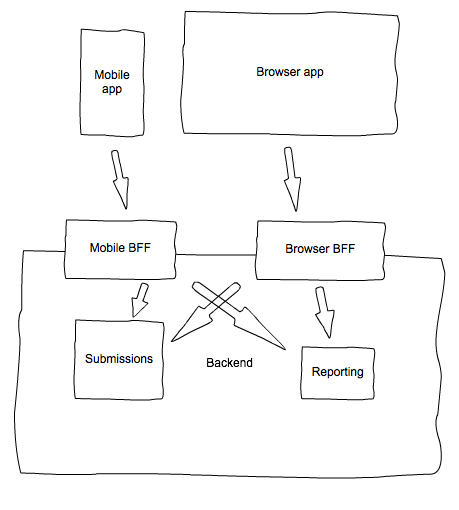
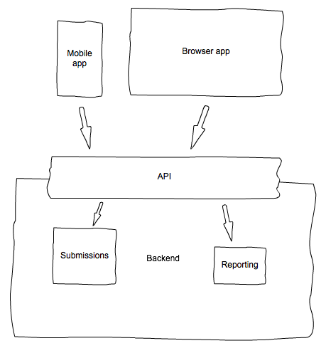
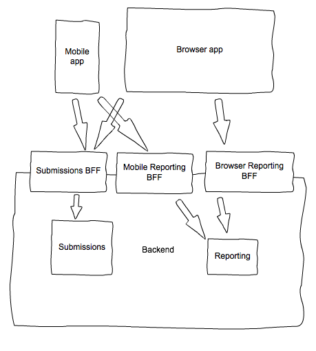

# trackerSpend-2
A new and improved trackerSpend!

Recently I've been reading a lot about microservices and I've found myself wanting to investigate further. I've noticed that there is a subtle difference between what is often perceived as service-oriented architecture (SOA) and what is actually a collection of microservices, and this confusion can mean not realising any of the benefits of microservices and SOA (since they should really be one and the same).

This project aims to explore an implementation of SOA. I will be using the same domain as in the [original trackerSpend](https://github.com/jdgillespie91/trackerSpend) but will focus on different things. In particular, I want to

* explore the [BFF pattern](http://samnewman.io/patterns/architectural/bff/).
* produce results that can clearly demonstrate the benefit of SOA.

### Current Progress
* I've decided on the high-level architecture for this project.
* I've started writing an API that allows a user to POST to the submissions microservice. The source code for this can be found in services/submissions/src.

### Up Next
* I want to be able to scalably deploy the submissions service. As such, my next goal is to be able to deploy the submissions service arbitrarily, likely behind a load balancer and using a queuing system such as SQS, such that I can submit a POST request and one of the services picks up the request and processes it.

## Functionality
I would like to enable the following:

* A user is able to submit expenditure and income from a native Android app or a browser.
* After an app submission, the user receives a push notification containing a summary of overall expenditure.
* After a browser submission, the user is redirected to a dashboard containing a summary of overall expenditure.

Note that

* An expenditure submission is a submission of amount, category and notes.
* An income submission is a submission of amount, categor, notes and, if category is reimbursements, a reimbursement category.
* A summary of overall expenditure is a report detailing the difference between expenditure and income, although the form this will take depends on whether the user has submitted on mobile or browser.
	* On mobile, this report will be a single message displaying the expenditure, the income and the overall expenditure for the past week.
	* On browser, this report will be a graph displaying the expenditure, income and overall expenditure for each calendar week for the current week and the previous 11 weeks.

## Architecture
I would like to implement the [BFF pattern](http://samnewman.io/patterns/architectural/bff/). While the scope of this project definitely doesn't require it, I think it's a great concept and implementing it here will enable me to realise its strengths and weaknesses better in the future.

The functionality I require means that I need:

* Two apps at the client level, a mobile app and a browser app.
* Two BFFs at the interface level, one per user experience (that is, one for the mobile app and one for the browser app).
* Two microservices, one for handling submissions and one for handling reporting.

I will expose the required methods of each component using HTTP REST.

It's important here to note that the role of the reporting microservice is to enable the two BFFs to expose the appropriate information. It shouldn't actually determine the appropriate information within the service.

In order to understand why this is a sensible choice, I'll talk about a couple of other options as well.

First, we have the monolith. The difference here is that instead of having BFFs, we have a single API that interfaces with both the submissions and reporting microservices.

This choice of architecture is undesirable because one of two things will happen:

* The API exposes a single reporting interface that cannot possibly be optimal for both clients. This is obviously not good.
* The API exposes two reporting interfaces, one per client. The issue here is less clear because of the scale of my project but suppose the same principles were applied to something much larger and more complex. The API would need to contain so much business logic and would become a bottleneck in development.

The second option I considered was having a BFF per function. That is, submissions would go through the same BFF but reporting would go through different ones.

In the [article on BFF](http://samnewman.io/patterns/architectural/bff/), Sam argues that a single team should maintain the client and the BFF. In this instance, who would maintain the submissions BFF? Would it be the mobile app team or the browser app team?

Of course, these options are essentially the same and would cause the same bottleneck described in the article; a change in the backend (in this case, the submissions BFF) would require the backend team to consult the other frontend team using the same API in order to come to some mutually agreeable solution. This is exactly the problem BFF tries to avoid and it has occurred here because the logic that should belong in the service has been bought up to the API level.

## Microservices

According to the architecture, I am going to need two microservices; submissions and reporting.

### Submissions

I anticipate this being a relatively easy microservice to implement and so I will write it in Go. It'll be my first real experience with Go so it's likely sensible to pay little attention to the actual code!

I'd like my microservice to have the following functionality:

* Portable. I'd like to be able to deploy my service anywhere (within reason) and have it function as I expect. I'm not sure exactly what this entails technically so it's something to bear in mind as I develop.
* Independent. It shouldn't rely on any other services. I should be able to deploy it and interact with it using the methods it exposes. The way I interact with it shouldn't matter.
